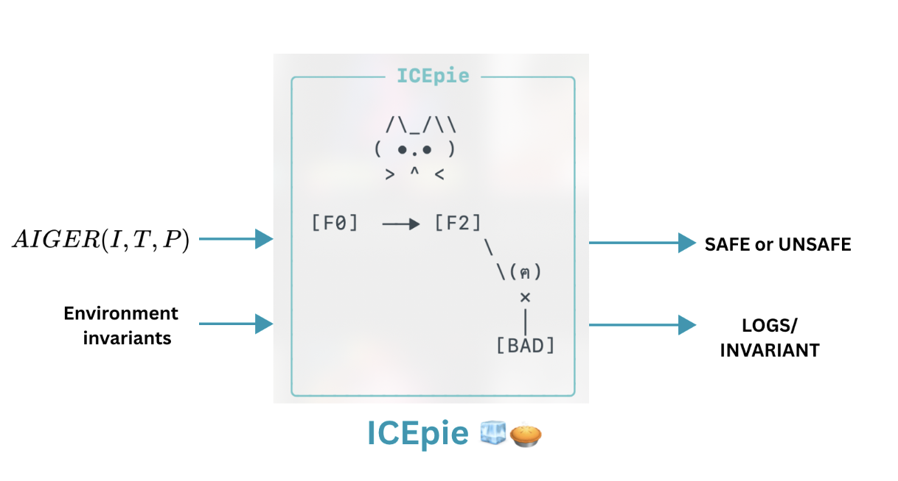
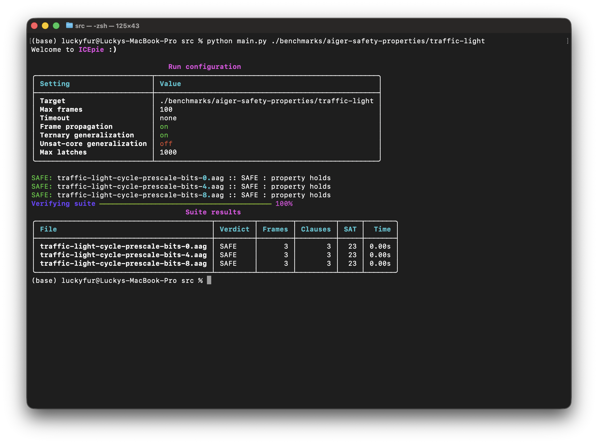

# ICEpie



This is an implementation of IC3 in python. This implementation is part of my masters thesis in CMI.

## Features Implemented

### Core engine

- Propositional safety model checking
- Delta-encoded frames with forward propagation and fixpoint (inductive-invariant) detection
- Verdicts: **SAFE** (invariant), **UNSAFE** (counterexample), **UNKNOWN** (frame bound), **TIMEOUT**

### Generalization

- **Ternary-simulation lifting** of CTIs
- **Inductive clause generalization**: drop-one (MIC) and unsat-core
- Unsat-core extraction **folded into the blocking solve** (one SAT call does block + generalize)

### Solver

- Single **incremental Z3 solver with activation literals**
- Per-file **timeout**

### AIGER front-end

- Parser for **ASCII (`.aag`) and binary (`.aig`)**
- Invariant **constraints** and the legacy outputs-as-bad convention

## Installation

1. Clone the repositiory.

```
git clone https://github.com/YOmaann/IC3.git
```

2. Goto `src` directory.

```
cd src
```

## Run

To run the tool type the command.

```
python main.py <path to .aig or .aag file or folder comtaining them>
```

## Parameters

The program accepts the following parameters.

1. `--max-frames` - The maximum number of frames the tool shall run.
2. `--no-propagate` - Disable the propagation phase.
3. `--timeout <seconds>` - Duration in seconds for per-file timeout feature.
4. `--no-ternary` - Disable generalization of CTI using ternary simulation.
5. `--use-unsatcore` - Use unsat core to shrink blocked clauses.

## Benchmarks

Tested the tool using the testcases at [tniessen/aiger-safety-properties](https://github.com/tniessen/aiger-safety-properties) (T. Niessen), plus HWMCC instances.

## Example

Running the tool on one of the folders in the above mentioned benchmarks.



## Requirements

- Python 3.9+
- [`z3-solver`](https://pypi.org/project/z3-solver/), [`rich`](https://pypi.org/project/rich/)
